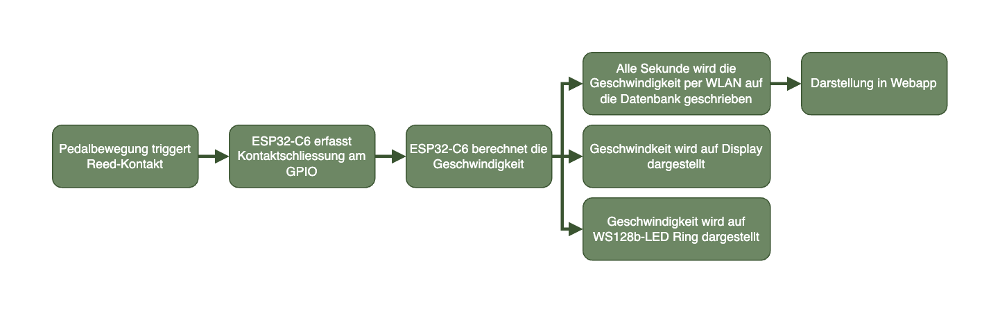
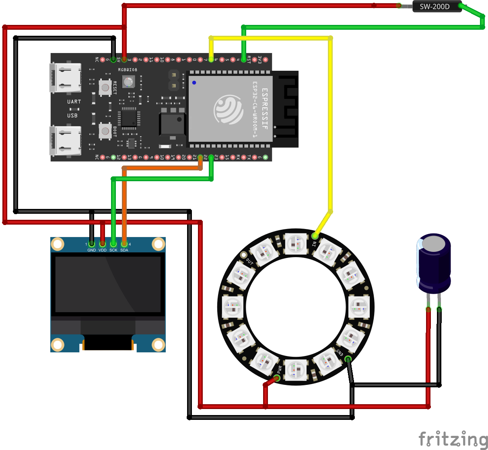

# README: Interaktive Velo-Installation

## Kurzbeschreibung des Projekts

* **Modul:** Interaktive Medien 4 an der Fachhochschule Graubünden (FS26)  
* **Themenfeld:** Interaktive Velo-Installation (Bewegung, Wettbewerb & digitale Visualisierung)
* **Name des Projekts:** `Interaktive Velo-Installation`   
* **Team Physical Computing:** `, Mark Hamann`   
* **Team WebApp:** `[NOTIZ: Namen ergänzen]`
 
### Problemstellung & Systemzweck
  Das Projekt löst kein klassisches Alltagsproblem, sondern ist spezifisch auf eine Installation im öffentlichen Raum angelegt. Es verbindet die physische Bewegung auf einem Fahrrad mit der digitalen Erfassung in einem digitalen Wettbewerb. Die Installation wird entwickelt für die "Polenta" und dem "Satelfest" von Pro Velo in Chur.

  Ziel ist es, eine interaktive und motivierende Erfahrung zu schaffen, bei der Besucher\*innen ihre Leistung direkt sehen können. Durch das Tracken von Echtzeitdaten (Geschwindigkeit, Distanz) und das Bereitstellen einer Live-Rangliste entsteht ein Gamification-Ansatz, der zu Bewegung und kleinen Wettkämpfen anspornt.

---

### UX & Konzeption

* **Figma:** [Link zum Figma](http://link.zum.figma) `[NOTIZ: Echten Link einfügen]`
* **User Flow & Screen Flow:**
  `[NOTIZ: Screenshot aus Figma hier einfügen oder verlinken]`

#### Features und Produktlogik
* **Angedachte Features:**
  * Echtzeit-Erfassung von Geschwindigkeit und Distanz über ein stationäres Fahrrad.
  * Live-Visualisierung der Fahrdaten auf einer Webapp.
  * Fahrer-Anmeldung mit einem selbst gewählten Namen vor der Fahrt.
  * Bestenliste/Rangliste mit den höchsten erreichten Geschwindigkeiten.
  * Separater, passwortgeschützter Administratorbereich zur Steuerung und Datenbereinigung.
  * Reduziertes physisches Display am Lenker für Core-Daten
* **Nicht umgesetzte Features:**
  `[NOTIZ: Welche Features wurden nicht umgesetzt und warum? Bitte hier ergänzen]`

---

## Setup

* **WebApp:** [Link zur Website](http://link.zur.website) `[NOTIZ: Echten Link einfügen]`  
* **Video-Dokumentation:** [Link zum Video auf Youtube](http://link.zum.video) `[NOTIZ: Echten Link einfügen]` 

### Installationsanleitung WebApp

`[NOTIZ: Hier kommt eine verständliche Schritt-für-Schritt-Anleitung für Aussenstehende rein.]`

1. **Infrastruktur:** `[NOTIZ: Welche Server-Infrastruktur/Node-Version/PHP-Version wird benötigt?]`
2. **Webserver-Installation:** `[NOTIZ: Befehle wie npm install / Composer install oder Klon-Anweisungen hier dokumentieren]`
3. **Datenbank-Import:** `[NOTIZ: Wie wird die SQL-Datei importiert?]`
4. **Datenbank-Credentials:** `[NOTIZ: In welcher Datei (.env / config.php) müssen die DB-Zugangsdaten eingetragen werden?]`
5. **Inbetriebnahme des physischen Artefakts:** `[NOTIZ: Wie wird der ESP32 geflasht? Wo trägt man die WLAN-Credentials im Code ein?]`

---

### Bauanleitung Physical Computing

#### Komponenten & Bauteile
Die Installation besteht aus folgenden Komponenten:
* Stationäres, aufgebocktes Fahrrad. Je Fahrrad:
* **ESP32-C6**  Zentrale Steuereinheit
* **Reed-Kontakt und zugehöriger Magnet an Speiche** (Erfassung der Rad- bzw. Pedalumdrehungen)
* **OLED-Display** (Direkte Anzeige der Geschwindigkeit am Rad)
* **WS128b 12px LED Ring** (Visuelle Darstellung der Geschwindigkeit)
* **3D Druck Bauteile** (als Gehäuse und Montage)

#### Kommunikationsprozess der Komponenten
1. **Pedalbewegung:** Beim Tretten bewegt sich ein Magnet am Reed-Kontakt vorbei und schliesst den Schalter-Kontakt
2. **Erfassung:** Der Reed-Kontakt (eingestellt im *Input-Pullup-Modus*) registriert das Signal an einem GPIO-Pin des ESP32-C6.
3. **Verarbeitung:** Der ESP32-C6 berechnet aus den Impulsen in Echtzeit Geschwindigkeit und Distanz.
4. **Lokale Anzeige:** Die aktuelle Geschwindigkeit wird auf dem OLED-Display und LED-Ring ausgegeben.
5. **Übertragung:** Die Daten werden alle Sekunde per WLAN an einen Server gesendet und in der Datenbank gespeichert.
6. **Webapp-Darstellung:** Die Webapp greift auf die Datenbank zu und visualisiert Daten und Ranglisten live.

#### Komponentenplan & Steckplan
* **Komponentenplan:** `[NOTIZ: Schaubild einfügen/verlinken, das Komponenten, Sensoren, Aktoren, Dateinamen der Programme und Kommunikationswege zeigt]`
* **Steckplan:** 

---

## Technische Details

### Projektstruktur / Code-Struktur
`[NOTIZ: Hier die Verzeichnisstruktur einfügen (z.B. als Baumdiagramm). Wichtig: Jede Datei muss im Kopfbereich eine kurze Zusammenfassung enthalten.]`

### Datenschnittstelle
`[NOTIZ: Wie genau kommunizieren WebApp und ESP32 miteinander? HTTP POST-Requests, WebSockets oder MQTT? Bitte Protokoll und Beispiel-Payload dokumentieren]`

### ERM (Entity-Relationship-Modell)
`[NOTIZ: Erklärung der Tabellenstrukturen (z.B. Users, Rides, Admins) sowie das grafische ERM-Schaubild hier einfügen]`

### Authentifizierung
`[NOTIZ: Erklärung einfügen, wie die Authentifizierung für den Administratorbereich und das Session-Handling der User gelöst wurde]`

---

## Known Bugs (Bekannte Probleme)

* Wenn das Gerät an einen neuen Ort bewegt wird, kann der Microcontroller keine Verbindung zu einem neuen Netzwerk herstellen ohne das Programm erneut zu flashen
* Der Umfang vom Rad als Berechnungsgrundlage für die Geschwindigkeit lässt sich nicht Benutzerseitig verändern.
* `[NOTIZ: Was funktioniert noch nicht einwandfrei?]`
* `[NOTIZ: Was ist während der Entwicklung aufgefallen?]`
* `[NOTIZ: Welche Optimierungen könnten in einer Version 2.0 vorgenommen werden?]`

---

## Umsetzungsprozess

### Reflexion / Erfahrung / Lernfortschritt
`[NOTIZ: Was wurde gelernt? Würdet ihr es wieder so machen? Was lief gut/schlecht?]`

### Herausforderungen & Lösungen
`[NOTIZ: Welche Fehler traten auf, welche Ansätze wurden verworfen, wie sahen die Umplanungen aus?]`

### KI-Einsatz
`[NOTIZ: Welche KI-Tools (z. B. ChatGPT, GitHub Copilot) wurden wofür eingesetzt und wie wurde der Nutzen bewertet?]`

### Fazit
`[NOTIZ: Abschliessendes Fazit zum Projektfortschritt und dem Endergebnis bei den Events.]`
